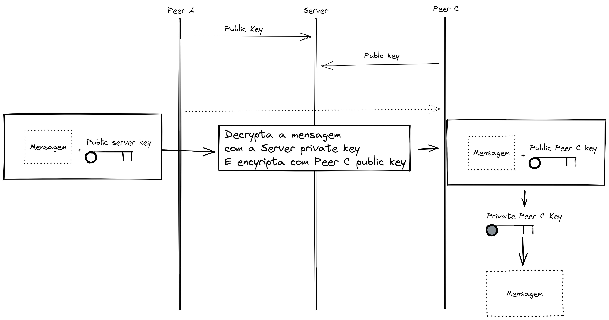

# Chat p2p encriptado

O objetivo dessa atividade é alterar o código do client e do server de tal forma que não seja possível observar o comportamento através de um [sniffer](https://www.wireshark.org/) na rede.

### Procedimentos para o teste

- Inicializar o Wireshark
- Iniciar o servidor `python Server.py`
- Em outros terminais, iniciar clients `python Server.py`

## Criptografar a mensagem

Inicialmente, tentei utilizar o algorítimo de **diffie-helman** para fazer a troca de chaves, mas com mais de dois peers conectados, a troca de chaves acabava ficando muito complexa. Por isso, decidi utilizar o algorítimo de **RSA**.

## Funcionamento

Partimos do pressuposto que todos os peers que irão se conectar sabem a chave pública do servidor. na conexão, o peer envia ao servidor sua chave pública. O servidor funciona como um banco de chaves, que armazena todas as chaves públicas dos peers conectados.

Para um peer A, se comunicar com o peer B

1. O peer A encripta a mensagem com a chave publica do servidor, e envia ao servidor
2. O servidor decripta a mensagem com sua chave privada
3. O servidor encripta a mensagem com a chave publica de B, e envia ao peer B
4. O peer B decripta a mensagem com sua chave privada

Criei um diagrama que representa o processo de troca de chaves.

## Vulnerabilidades
